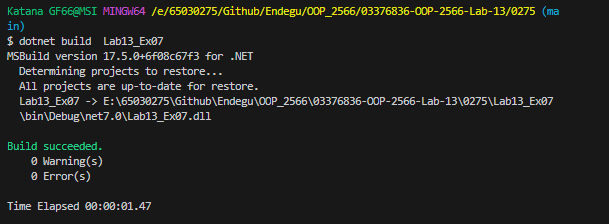
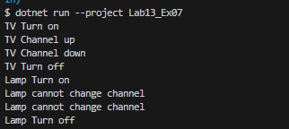

interface IRemoteControl ไม่ควรใส่ public หน้าเมธอด เนื่องจากเมธอดใน interface จะถูกสาธิตอยู่โดยอัตโนมัติเสมอ และในคลาส PowerAppliance

using System;

interface IRemoteControl
{
    void TurnOn();
    void TurnOff();
    void ChannelUp();
    void ChannelDown();
}

abstract class PowerAppliance
{
    public bool PowerStatus { get; set; }
    public int Wattage { get; set; }
}

class Television : PowerAppliance
{
    public int Channel { get; set; }
}

class Lamp : PowerAppliance
{
}

class SonyTV : Television, IRemoteControl
{
    public void TurnOn() { Console.WriteLine("TV Turn on"); PowerStatus = true; }
    public void TurnOff() { Console.WriteLine("TV Turn off"); PowerStatus = false; }
    public void ChannelUp() { Console.WriteLine("TV Channel up"); }
    public void ChannelDown() { Console.WriteLine("TV Channel down"); }
}

class DesktopLamp : Lamp, IRemoteControl
{
    public void TurnOn() { Console.WriteLine("Lamp Turn on"); PowerStatus = true; }
    public void TurnOff() { Console.WriteLine("Lamp Turn off"); PowerStatus = false; }
    public void ChannelUp() { Console.WriteLine("Lamp cannot change channel"); }
    public void ChannelDown() { Console.WriteLine("Lamp cannot change channel"); }
}

class Program
{
    static void Main(string[] args)
    {
        Television myTV = new SonyTV();
        myTV.Wattage = 100;
        myTV.TurnOn();
        myTV.ChannelUp();
        myTV.ChannelDown();
        myTV.TurnOff();

        Lamp myLamp = new DesktopLamp();
        myLamp.Wattage = 50;
        myLamp.TurnOn();
        myLamp.ChannelUp();
        myLamp.ChannelDown();
        myLamp.TurnOff();
    }
}
โค้ดที่แก้ดีกว่า
สามารถเปลี่ยน PowerStatus และ Wattage เป็น auto-implemented properties เพื่อสะดวกในการอ่าน