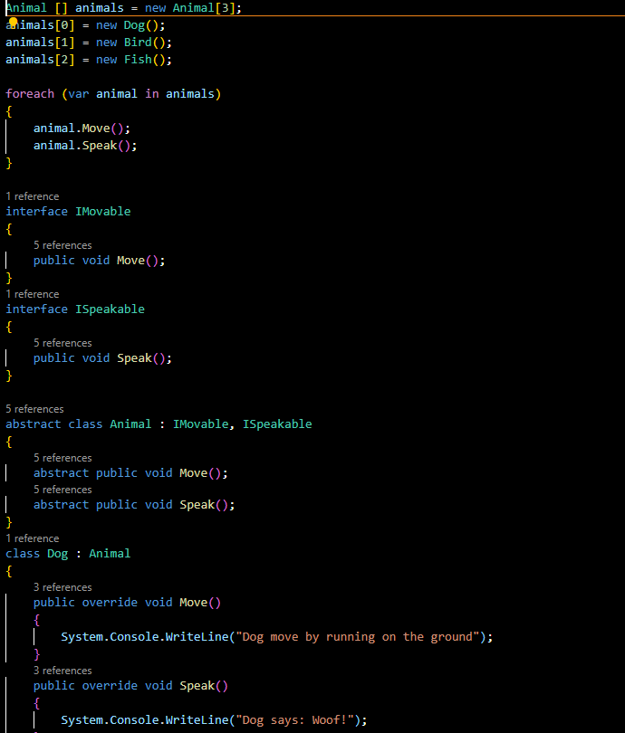
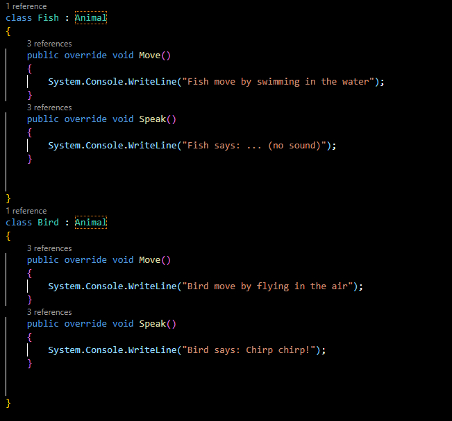
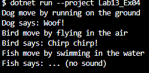

## 3
## ไม่สามารถ built ได้เนื่องจาก มี Error
## Error : Speakable.Speak() ไม่ได้เพิ่มถูกประกาศลงใน abstract class Animal และไม่ได้สืบทอด Animal.Speak() ไปยังคลาส Bird, Dog, Fish
## แก้ไข 

## ทำการประกาศ speak(); ใน abstract class animal จากนั้นเพิ้ม animal.Speak(); เพื่อให้แสดงผลออกมา และเพิ่ม speak(); ไปยังclassอื่นๆ
## 5

## สามารถรันและแสดงผลตามที่ต้องการได้